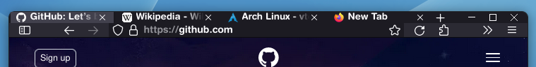
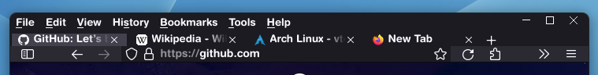
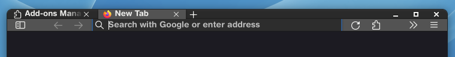
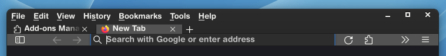
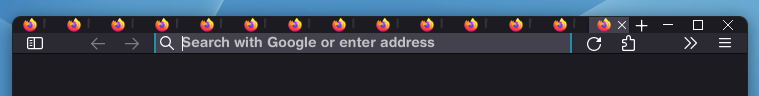
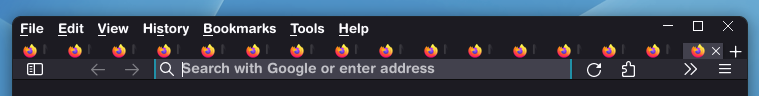

# Small bars and no scrolling tabs userChrome.css for FireFox 116.0.3
## With CSD:

## With Adwaita:

## No scrolling tab overflow mode:

# Installing:

 - Enable "toolkit.legacyUserProfileCustomizations.stylesheets" on "about:config" page.
 - Go to "about:profiles" and open the root directory of the default profile.
 - Place modded userChrome.css in the "chrome" directory of the profile
  (if there isn't any, then create it).
  - Restart FireFox.

